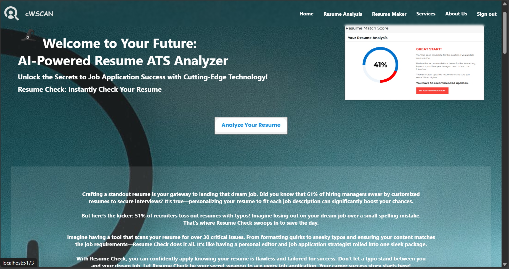
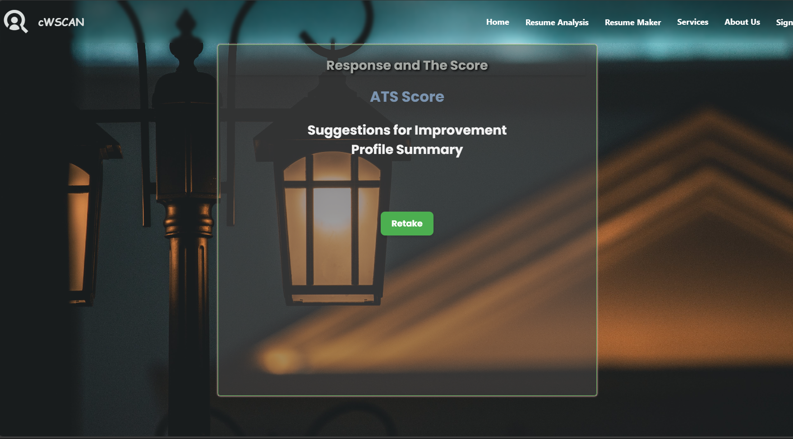

# ATS Resume Scanner

The **ATS Resume Scanner** is a web-based application designed to help job seekers optimize their resumes to pass through Applicant Tracking Systems (ATS). This tool analyzes resumes, checks for important keywords, formatting issues, and suggests improvements to increase the chances of getting shortlisted.

## Features
- **ATS Compatibility Check**: Analyze your resume's compatibility with ATS systems.
- **Keyword Suggestions**: Get keyword recommendations based on the job description.
- **Formatting Analysis**: Check if your resume formatting meets industry standards.
- **Score & Feedback**: Receive a score on how well your resume performs and suggestions for improvements.

## Screenshots
Below are some screenshots showing the functionality of the ATS Resume Scanner web application.

### Home Page


### Resume Upload Page


### Result Page


## Installation

To run the ATS Resume Scanner locally on your machine, follow these steps:

### Prerequisites
Make sure you have the following installed:
- [Node.js](https://nodejs.org/) (version 14 or above)
- [npm](https://npmjs.com/) (Node package manager)

### Steps to Run Locally
1. Clone this repository:
    ```bash
    git clone https://github.com/your-username/ats-resume-scanner.git
    ```
2. Navigate to the project folder:
    ```bash
    cd ats-resume-scanner
    ```
3. Install dependencies:
    ```bash
    npm install
    ```
4. Start the development server:
    ```bash
    npm run dev
    ```
    This will launch the application at `http://localhost:3000` in your browser.

## Usage

1. **Upload a Resume**: Go to the homepage and upload your resume (in PDF or Word format).
2. **ATS Compatibility Check**: The tool will analyze your resume and provide a score on how well it fits with ATS systems.
3. **Review Suggestions**: Based on the analysis, you'll receive suggestions for improving your resume's chances of passing through ATS.

## Tech Stack

- **Frontend**: React.js, CSS
- **Backend**: Node.js, Express.js 
- **Libraries**: [pdf-lib](https://github.com/Hopding/pdf-lib), [react-file-upload](https://www.npmjs.com/package/react-file-upload)
- **ATS Algorithms**: Custom keyword matching and scoring algorithm based on industry standards.

## Contributing

We welcome contributions! If you have suggestions or improvements, feel free to fork the repository, create a branch, and submit a pull request.

1. Fork the repository.
2. Create a new branch (`git checkout -b feature-name`).
3. Make your changes and commit them (`git commit -m 'Add new feature'`).
4. Push to the branch (`git push origin feature-name`).
5. Open a pull request.

## License

This project is licensed under the MIT License - see the [LICENSE](LICENSE) file for details.

## Acknowledgements
- Inspiration: Various online resources and ATS-related articles.
- Libraries: React, Node.js, pdf-lib, etc.
